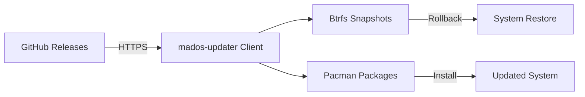
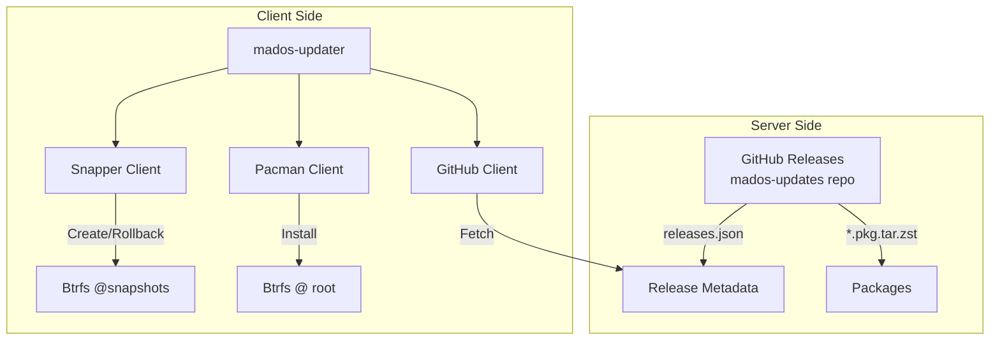
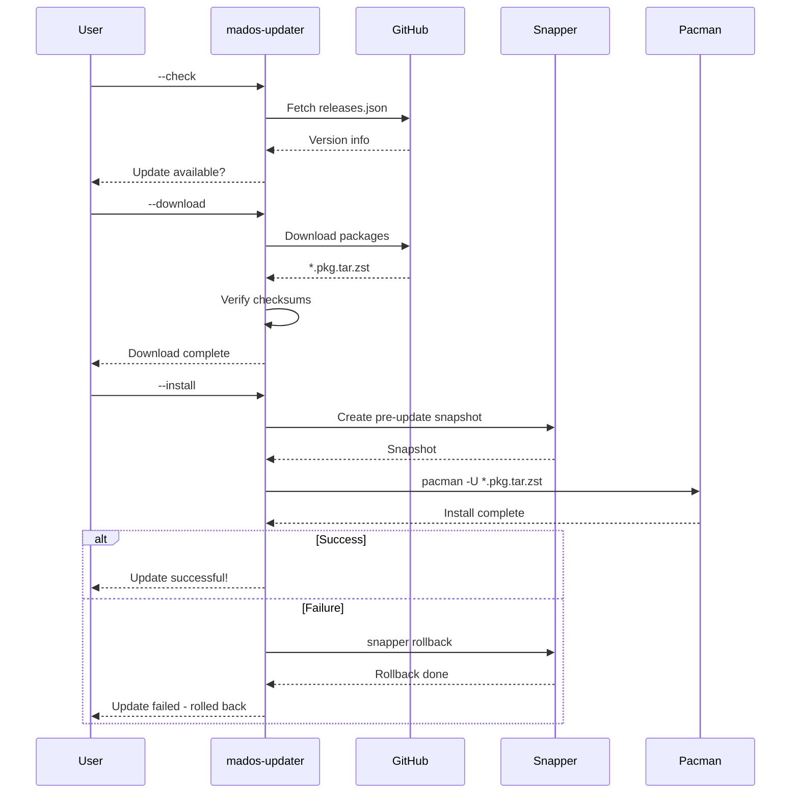
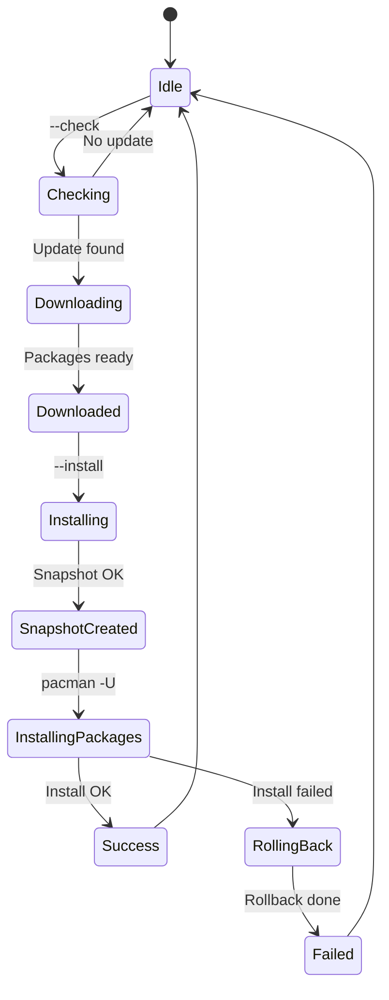

# madOS Updater

OTA update system for madOS with Btrfs snapshots and automatic rollback.

## Features

- **Atomic Updates** with Btrfs snapshot rollback
- **Differential Updates** via Pacman packages
- **GitHub Releases** as update hosting
- **User-friendly** notifications and confirmation dialog

## Overview

madOS Updater provides seamless system updates with automatic rollback capability. Using Btrfs copy-on-write snapshots, the system can instantly revert to a pre-update state if anything goes wrong.



## Architecture



## Update Flow



## Update Process States



## Requirements

### Server-Side

- GitHub account with `mados-updates` repository
- GitHub Releases enabled for hosting packages

### Client-Side

- Btrfs root filesystem (`/`)
- `btrfs-progs` - Btrfs utilities
- `snapper` - Snapshot management
- `pacman-contrib` - Pacman hooks support
- `curl` - HTTP client

## Installation

```bash
# Install dependencies
pacman -S btrfs-progs snapper pacman-contrib curl

# Clone and install
git clone https://github.com/madkoding/mados-updater.git
cd mados-updater
pacman -U mados-updater-*.pkg.tar.zst

# Enable automatic updates (checks hourly)
systemctl enable --now mados-updater.timer
```

## Usage

```bash
# Check for updates
mados-updater --check

# Download available updates
mados-updater --download

# Install downloaded updates
mados-updater --install

# Rollback to previous state
mados-updater --rollback

# Show current status
mados-updater --status

# Rollback to specific snapshot
mados-updater --rollback --snapshot 42
```

## Configuration

Edit `/etc/mados-updater.conf`:

```ini
[updater]
repo_url = https://github.com/madkoding/mados-updates
channel = stable
check_interval = 3600
auto_download = false
auto_install = false

[notifications]
enabled = true
use_dialog = true
```

| Option | Default | Description |
|--------|---------|-------------|
| `repo_url` | - | GitHub repository URL for updates |
| `channel` | stable | Release channel (stable/beta) |
| `check_interval` | 3600 | Seconds between update checks |
| `auto_download` | false | Automatically download updates |
| `auto_install` | false | Automatically install after download |
| `use_dialog` | true | Use zenity dialogs instead of notifications |

## Snapper Configuration

Ensure `/etc/snapper/configs/root` has:

```
SUBVOLUME="/"
ALLOW_USERS="root"
TIMELINE_CREATE="no"
NUMBER_LIMIT="1"
NUMBER_LIMIT_IMPORTANT="1"
```

## Release Metadata

The `releases.json` file structure:

```json
{
  "version": "1.0.1",
  "release_date": "2024-01-15",
  "min_supported_version": "1.0.0",
  "changelog": "- Bug fixes\n- Performance improvements",
  "checksum": "sha256-checksum-of-packages",
  "download_url": "https://github.com/...",
  "packages": [
    {"name": "mados-core", "version": "1.0.1-1"},
    {"name": "mados-desktop", "version": "1.0.1-1"}
  ]
}
```

## Security

- **HTTPS**: All downloads use encrypted connections
- **SHA256 Checksums**: Package integrity verification
- **GitHub Releases**: Relies on GitHub's authentication
- **Root Privileges**: Required for system modifications, tracked by snapper

## FAQ

### What happens if power is lost during an update?

The system will boot into the pre-update snapshot. Btrfs ensures all changes are atomic, and snapper provides a clean rollback path.

### How much disk space is needed?

Minimum 2x the size of packages being installed. Btrfs copy-on-write means snapshots don't duplicate data initially.

### Can I opt out of automatic updates?

Yes. Set `auto_install = false` in the configuration. You'll receive notifications but must manually approve updates.

## Demo Mode

Run without making actual changes:

```bash
DEMO_MODE=true mados-updater --check
DEMO_MODE=true mados-updater --download
DEMO_MODE=true mados-updater --install
```

## Testing

```bash
# Run unit tests
python3 -m unittest discover -s tests -v
```

## Documentation

See [docs/PLAN.md](docs/PLAN.md) for detailed architecture and implementation plan.

## Related Projects

- [madOS Installer](https://github.com/madkoding/mados-installer) - madOS installation tool
- [madOS Desktop](https://github.com/madkoding/mados-desktop) - madOS desktop environment

## License

MIT
